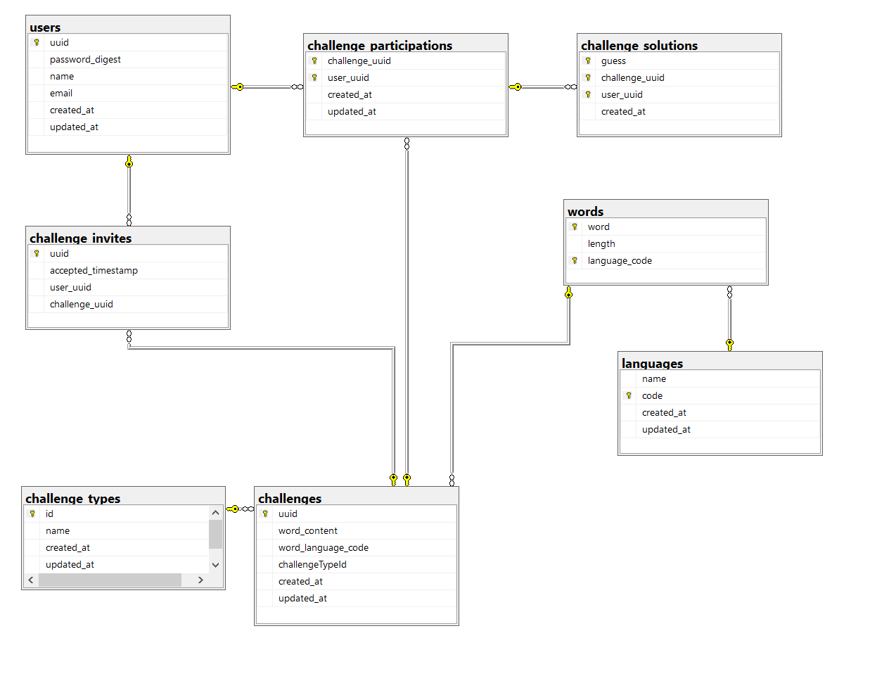

# Projekt bazy do gry komputerowej podobnej do [wordle](https://www.powerlanguage.co.uk/wordle/) lub [literalnie.fun](https://literalnie.fun/)

**Autor:** Jakub Surdej

**Nr albumu:** 14009

**Grupa laboratoryjna:** 7

## Opis bazy danych

Zaprojektowana baza danych służy do przetrzymywania danych aplikacji podobnej do wymienionej w tytule gier.
Baza zawiera funkcjonalności takie jak dodawanie słów, gier, użytkowników, czy zaproszeń.
Gra polega na odgadnięciu pseudolosowo wybranego słowa.

## Wykaz tabel

Baza składa się z 8 tabel:

1. users
1. languages
1. words
1. challenges
1. challenge_types
1. challenge_participations
1. challenge_solutions
1. challenge_invites



## Wykaz widoków

### random

Widok stworzony do pobierania pseudolosowej wartości hexadecymalnej w funkcjach (użycie funkcji w funkcji jest często problematyczne bez tego).

```sql
CREATE VIEW [dbo].[random]
AS
    SELECT CRYPT_GEN_RANDOM(4) AS random_value;
```

Przykład użycia:

```sql
SELECT * FROM random;
```

### scoreboard

Widok wyświetlający punktację dla użytkowników (za punkt uznawane jest prawidłowe zgadnięcie słowa)

```sql
CREATE VIEW [dbo].[scoreboard] AS
    SELECT COUNT(*) as correct_answers, [dbo].[challenge_participations].[user_uuid] FROM [dbo].[challenge_participations]
    LEFT JOIN [dbo].[challenges] ON [dbo].[challenge_participations].[challenge_uuid] = [dbo].[challenges].[uuid]
    LEFT JOIN [dbo].[challenge_solutions] ON [dbo].[challenges].[word_content] = [dbo].[challenge_solutions].[guess] GROUP BY [dbo].[challenge_participations].[user_uuid];
```

Przykład użycia:

```sql
SELECT * FROM scoreboard ORDER BY correct_answers DESC;
```

### popular_words

Widok wyświetlający słowa wraz z ilością ich użycia w wyzwaniach

```sql
CREATE VIEW [dbo].[popular_words] AS
    SELECT [dbo].[challenges].[word_content], [dbo].[languages].[name], COUNT(*) as [count] FROM challenges
    LEFT JOIN [dbo].[languages] ON [dbo].[challenges].[word_language_code] = [dbo].[languages].[code]
    GROUP BY [dbo].[languages].[name], [dbo].[challenges].[word_content];
```

Przykład użycia:

```sql
SELECT * FROM popular_words ORDER BY count DESC;
```

## Wykaz funkcji

### get_random_word

Zwraca pseudolosowe słowo dla danego języka. Jako domyślny język używa angielski.

```sql
CREATE FUNCTION get_random_word
    (@lang NVARCHAR(3) = 'en')
RETURNS NVARCHAR(100)
AS
BEGIN
    DECLARE @word NVARCHAR(100)
    SET @word = (SELECT TOP 1 [word] FROM [dbo].[words] WHERE [language_code] = @lang ORDER BY (SELECT TOP 1 * FROM [dbo].[random]))
    RETURN @word
END;
```

Przykład użycia

```sql
SELECT [dbo].[get_random_word] (DEFAULT)
```

### users_by_challenge_count

Zwraca uuid użytkowników wraz z ilością wyzwań, w których brali udział (dla danego języka- domyślny angielski)

```sql
CREATE FUNCTION users_by_challenge_count
    (@lang NVARCHAR(3) = 'en')
RETURNS TABLE
AS
RETURN 
    SELECT [user_uuid], COUNT([challenge_participations].[challenge_uuid]) AS [challenge_count]
    FROM [dbo].[users] RIGHT JOIN [dbo].[challenge_participations]
    ON [challenge_participations].[user_uuid] = [users].[uuid]
    LEFT JOIN [dbo].[challenges] ON [challenges].[uuid] = [challenge_uuid]
    WHERE [word_language_code] = @lang
    GROUP BY [user_uuid];
```

Przykład użycia

```sql
SELECT * FROM users_by_challenge_count('en') ORDER BY challenge_count DESC;
```

### solutions_for_lang

Zwraca liczbę prób odgadnięcia prawidłowego hasła dla wszystkich (łącznie) wyzwań dla danego języka

```sql
CREATE FUNCTION solutions_for_langs ()
RETURNS TABLE
AS
RETURN 
    SELECT [word_language_code], COUNT(*) as [count]
    FROM [dbo].[challenge_solutions]
    LEFT JOIN [dbo].[challenges]
    ON [challenges].[uuid] = [challenge_solutions].[challenge_uuid]
    GROUP BY [word_language_code];
```

Przykład użycia:

```sql
SELECT * FROM solutions_for_langs();
```

## Wykaz procedur

### insert_word

Insertuje słowo do bazy danych. Automatycznie dodaje jego długość.

```sql
CREATE PROCEDURE [dbo].[insert_word]
    @language_code NVARCHAR(3),
    @word NVARCHAR(100)
AS
BEGIN
    INSERT INTO [dbo].[words] ([word], [language_code], [length])
    VALUES (@word, @language_code, LEN(@word))
END
```

Przykład użycia:

```sql
EXEC insert_word 'pl', 'zwięźle'
```

### start_game

Tworzy nowe wyzwanie dla danego języka i typu, wybiera dla niego pseudolosowo słowo, zaprasza do udziału w nim 10 użytkowników.

```sql
CREATE PROCEDURE [dbo].[start_game]
    @language_code NVARCHAR(3),
    @type_id INT
AS
BEGIN
    BEGIN TRANSACTION;
    SAVE TRANSACTION [start_game_transaction];

    DECLARE @word NVARCHAR(100)
    DECLARE @challenge_uuid NVARCHAR(36)
    DECLARE @random_players_uuids TABLE (uuid NVARCHAR(36))

    BEGIN TRY
        SET @word = [dbo].[get_random_word] (@language_code);
        SET @challenge_uuid = NEWID()

        INSERT INTO [dbo].[challenges] ([uuid], [word_content], [word_language_code], [challengeTypeId], [updated_at])
        VALUES (@challenge_uuid, @word, @language_code, @type_id, GETDATE());

        --- selecting random 10 players to invite
        INSERT INTO @random_players_uuids SELECT TOP 10 [uuid] FROM [dbo].[users] ORDER BY CRYPT_GEN_RANDOM(4)

        INSERT INTO [dbo].[challenge_invites] ([uuid], [user_uuid], [challenge_uuid])
        SELECT NEWID(), [uuid], @challenge_uuid FROM @random_players_uuids
    COMMIT TRANSACTION 
    END TRY

    BEGIN CATCH
        IF @@TRANCOUNT > 0
        BEGIN
            ROLLBACK TRANSACTION [start_game_transaction]; -- rollback to start_game_transaction save point
       END
    END CATCH
END
```

Przykład użycia:

```sql
EXEC start_game 'pl', 1
```

### drop_challenge_duplicates

Wyszukuje wyzwań, dla których powtarza się słowo i zostawia tylko najstarsze z nich. Nie ma praktycznego zastosowania.

```sql
CREATE PROCEDURE [drop_challenge_duplicates]
AS
BEGIN
WITH [duplicates] AS (
    SELECT ROW_NUMBER() OVER(PARTITION BY [word_content], [word_language_code] ORDER BY [created_at] DESC)
    AS [rn]
    FROM [dbo].[challenges]
)
DELETE [duplicates] WHERE [rn] > 1
END;
```

Przykład użycia:

```sql
EXEC drop_challenge_duplicates
```

## Przykładowe instrukcje

```sql
SELECT TOP 10 * FROM challenges WHERE [word_language_code] = 'en' ORDER BY [created_at];
```

Zwraca 10 najnowszych wyzwań dla języka angielskiego.
